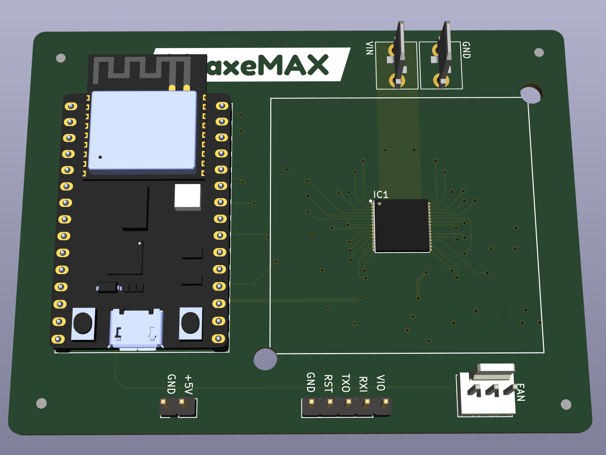

# The bitaxe


an early-stage experimental bitcoin mining machine. Uses two Bitmain BM1387 ASICs.

## BM1387


- The BM1387 is a undocumented SHA256 mining ASIC from Bitmain. It's mostly used in the Antminer S9
- Bitmain claims the BM1387 has 0.098j/Gh efficiency
- The BM1387 is available for around $1-2 each in low quantities from Aliexpress

## Current Status
- I have built a couple v2 PCBs
- So far everything seems to be working properly.
- I can mine using the [cgminer](https://github.com/wareck/cgminer-gekko) modified for gekkoscience USB stick miners.
    - Don't forget to modify the [GSH Driver_gekko](https://github.com/wareck/cgminer-gekko/blob/8c579bb88058b01dd524de0459621c8c57d34cb9/usbutils.c#L1058) in usbutils.c to match the iManufacturer and iProduct of the FTDI USB serial adapter you are using.
    - For the jim.sh adapter I'm using, use the following values;
    ```
    .idVendor = 0x0403,
    .idProduct = 0x6015,
    .iManufacturer = "FTDI",
    .iProduct = "FT230X Basic UART",
    ```

## Hardware
- [BM1387B from random AliExpress seller](https://www.aliexpress.com/item/2251832867687077.html). These appear to work!
- [40x40mm heatsink and 5V fan](https://www.aliexpress.com/item/2251832861666365.html) from a random AliExpress seller. At least half of these arrived broken in some way. But they are cheap and the working ones do keep the BM1387's nice and cool when used with some thermal compound.
- The serial port is 1.8V. The [FTDI TTL-232RG-VREG1V8-WE](https://www.digikey.com/en/products/detail/ftdi,-future-technology-devices-international-ltd/TTL-232RG-VREG1V8-WE/2441359) USB adapter does the trick, although it's pretty expensive.
- [jim.sh Micro1v8 FT230X](https://www.amazon.com/dp/B076B9YRMP) adapters also work.
- Neither the FTDI cable or the jim.sh adapter breakout any of the CBUS pins that could be used for the reset line.
    - for that I'm going to try the [UMFT231XE-01](https://www.digikey.com/en/products/detail/ftdi-future-technology-devices-international-ltd/UMFT231XE-01/4487117) breakout board.
- [KiCad 6](https://www.kicad.org) design files
- All of the parts on the board are listed in the KiCad BOM

## Software
Check my [BM1387 Scripts](https://github.com/skot/bm1387_scripts)!

## Connections


| Pin Name     | Description |
| ----------- | ----------- |
| VIN      | ASIC VIN - powers both ASICs in series. Should be around 0.9V for 0.450V at each ASIC. Will need at least 3A, maybe more! This needs more experimentation.       |
| +5V   | 5V input gets regulated to 1.8V and 0.8V for the BM1387. Also 5V for Fan output. Not much current required.        |
| +5V (Fan)   | 5V output for fan        |
| SPD (Fan)   | Speed input from fan. Doesn't currently go anywhere        |
| 1V8   | 1.8V output. regulated from 5V. Use as a IO reference, or leave unconnected.       |
| RXI   | 1.8V Serial input        |
| TXO   | 1.8V Serial output        |
| RST   | Inverted reset pin to the first BM1387. Unsure how necessary this is.        |
| GND   | Common ground        |

## Goals
- Figure out the BM1387 communication and put all of that in an onboard microcontroller like the ESP32-C3 (RISC-V, yum).
- Connect up the BM1387 internal temperature to the onboard microcontroller.
- Connect up the fan speed sensor to the onboard microcontroller.
- Develop some software in Rust to getblocktemplate from a bitcoin node and communicate work to a fleet of bitaxes.
- add an onboard power sensor so we can set the hashrate (ASIC requency) and therefore current to extract maximum power from a solar panel.
